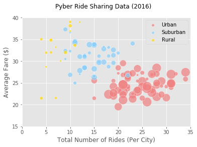
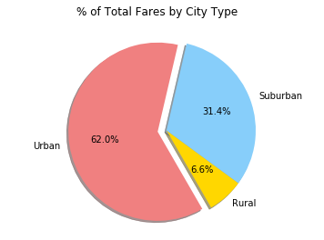

## Pyber Ride Sharing
- Looking at the bubble plot, we can see that as we move from rural to suburban to urban areas, there are more riders and drivers.
- Also, the average fare price goes down as we move into urban cities.
- Comparing the pie charts of total rides and total drivers, we see that there are more riders in urban areas than drivers, while there are more drivers than riders in urban and suburban areas.

```python
# Import Dependencies
import pandas as pd
import matplotlib.pyplot as plt
import numpy as np
import seaborn as sns

# Read csv files
city = pd.read_csv('raw_data/city_data.csv')
ride = pd.read_csv('raw_data/ride_data.csv')
```


```python
# Merge datasets
city_ride = pd.merge(city, ride, on='city')

# Group by city
grouped = city_ride.groupby('city')

# Get average fare, total drivers, total rides, and city type 
avg_fare = grouped['fare'].mean()
total_rides = grouped['ride_id'].count()
total_drivers = grouped['driver_count'].mean()
city_type = grouped['type'].max()

# Create dataframe with information 
city_ride_df = pd.DataFrame({'Average Fare ($) Per City': avg_fare,
                   'Total Rides Per City': total_rides,
                   'Total Drivers Per City': total_drivers,
                   'City Type': city_type})
city_ride_df.index.name = 'City'
city_ride_df['Average Fare ($) Per City'] = city_ride_df['Average Fare ($) Per City'].map('{:.2f}'.format)

city_ride_df.head()
```


<div>
<table border="1" class="dataframe">
  <thead>
    <tr style="text-align: right;">
      <th></th>
      <th>Average Fare ($) Per City</th>
      <th>City Type</th>
      <th>Total Drivers Per City</th>
      <th>Total Rides Per City</th>
    </tr>
    <tr>
      <th>City</th>
      <th></th>
      <th></th>
      <th></th>
      <th></th>
    </tr>
  </thead>
  <tbody>
    <tr>
      <th>Alvarezhaven</th>
      <td>23.93</td>
      <td>Urban</td>
      <td>21</td>
      <td>31</td>
    </tr>
    <tr>
      <th>Alyssaberg</th>
      <td>20.61</td>
      <td>Urban</td>
      <td>67</td>
      <td>26</td>
    </tr>
    <tr>
      <th>Anitamouth</th>
      <td>37.32</td>
      <td>Suburban</td>
      <td>16</td>
      <td>9</td>
    </tr>
    <tr>
      <th>Antoniomouth</th>
      <td>23.62</td>
      <td>Urban</td>
      <td>21</td>
      <td>22</td>
    </tr>
    <tr>
      <th>Aprilchester</th>
      <td>21.98</td>
      <td>Urban</td>
      <td>49</td>
      <td>19</td>
    </tr>
  </tbody>
</table>
</div>


## Bubble Plot of Ride Sharing Data
```python
# Change average fare to numeric 
city_ride_df['Average Fare ($) Per City'] = pd.to_numeric(city_ride_df['Average Fare ($) Per City'])

# Create bubble plot for urban cities
urban = city_ride_df.loc[city_ride_df['City Type'] == 'Urban']
ux = urban['Total Rides Per City']
uy = urban['Average Fare ($) Per City']
uz = urban['Total Drivers Per City']

urban_plt = plt.scatter(ux, uy, s=uz*5, c='lightcoral', edgecolors='white', alpha=0.7, label='Urban')

# Create bubble plot for suburban cities
suburban = city_ride_df.loc[city_ride_df['City Type'] == 'Suburban']
sx = suburban['Total Rides Per City']
sy = suburban['Average Fare ($) Per City']
sz = suburban['Total Drivers Per City']

suburban_plt = plt.scatter(sx, sy, s=sz*5, c='lightskyblue', edgecolors='white', alpha=0.7, label='Suburban')

# Create bubble plot for rural cities
rural = city_ride_df.loc[city_ride_df['City Type'] == 'Rural']
rx = rural['Total Rides Per City']
ry = rural['Average Fare ($) Per City']
rz = rural['Total Drivers Per City']

rural_plt = plt.scatter(rx, ry, s=rz*5, c='gold', edgecolors='white', alpha=0.7, label='Rural')

# Set axis limits and labels
plt.ylim(15, 40)
plt.xlim(0, 35)
plt.xlabel('Total Number of Rides (Per City)')
plt.ylabel('Average Fare ($)')

# Use suptitle for entire figure 
plt.suptitle('Pyber Ride Sharing Data (2016)')

# Create legend and format legend markers
legend = plt.legend(loc = "best", numpoints = 1, fontsize = 10)
legend.legendHandles[0]._sizes = [30]
legend.legendHandles[1]._sizes = [30]
legend.legendHandles[2]._sizes = [30]

# Save figure
plt.savefig("pyber_rideshare_data.png")

# Show all bubble plots
plt.show()
```





## Total Fares by City Type
```python
# Get sum of total fares from city_ride
city_group = city_ride.groupby(['type'])
fares = city_group['fare'].sum()

# Create pie chart
labels = fares.index
colors = ['gold', 'lightskyblue', 'lightcoral']
explode = [0,0,0.1]

plt.pie(fares, explode=explode, colors=colors, labels=labels, 
        startangle=-60, autopct='%1.1f%%', shadow=True)

# Create title
plt.suptitle('% of Total Fares by City Type')

# Set axis to equal for a circular piechart
plt.axis('equal')

# Save figure
plt.savefig("totalfares.png")

# Show pie chart
plt.show()
```





## Total Rides by City Type
```python
# Calculate % of total rides by city type
# I could have just used groupby but here's a different way of doing it
total_rides = city_ride_df['Total Rides Per City'].sum()
u_ride = urban['Total Rides Per City'].sum()
ur_slice = u_ride/total_rides * 100

sub_ride = suburban['Total Rides Per City'].sum()
subr_slice = sub_ride/total_rides * 100

r_ride = rural['Total Rides Per City'].sum()
rr_slice = r_ride/total_rides * 100

# Create pie chart
labels = ['Urban', 'Rural', 'Suburban']
sizes = [ur_slice, rr_slice, subr_slice]
colors = ['lightcoral', 'gold', 'lightskyblue']
explode = (0.1, 0, 0)

plt.pie(sizes, explode=explode, labels=labels, colors=colors,
        autopct="%.1f%%", shadow=True, startangle=60)

# Create title and set axis to equal
plt.suptitle('% of Total Rides by City Type')
plt.axis('equal')

# Save figure
plt.savefig("totalrides.png")

# Show pie chart
plt.show()
```


## Total Drivers by City Type
```python
# Calculate % of total drivers by city type
total_drivers = city_ride_df['Total Drivers Per City'].sum()
u_drive = urban['Total Drivers Per City'].sum()
ud_slice = u_drive/total_drivers * 100

sub_drive = suburban['Total Drivers Per City'].sum()
subd_slice = sub_drive/total_drivers * 100

r_drive = rural['Total Drivers Per City'].sum()
rd_slice = r_drive/total_drivers * 100

# Create pie chart
labels = ['Urban', 'Rural','Suburban']
sizes = [ud_slice, rd_slice, subd_slice]
colors = ['lightcoral', 'gold', 'lightskyblue']
explode = (0.1, 0, 0)

plt.pie(sizes, explode=explode, labels=labels, colors=colors,
        autopct="%.1f%%", shadow=True, startangle=40)

# Create title and set axis to equal
plt.suptitle('% of Total Drivers by City Type')
plt.axis('equal')

# Save figure
plt.savefig("totalrides.png")

# Show pie chart
plt.show()
```


